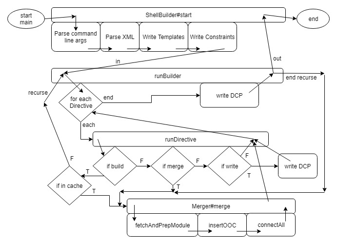

<!-- markdownlint-disable MD010 -->

# ShellBuilder Documentation

Construct designs for Xilinx FPGAs sequentially using [RapidWright](https://www.rapidwright.io/).

Main worker is main.top.ShellBuilder

More documentation and links to RapidWright's documentation in [Additional Reading](#7-additional-reading). Also found there is how to generate JavaDocs for ShellBuilder.

## 1 About

Author: Isidor Randall Brkic

Email: igi.brkic@mail.utoronto.ca

Supervisor: Prof. Paul Chow

Institution: University of Toronto

Date: Summer 2019

### 1.1 Description

The goal of this project is to provide an alternative workflow for creating designs for Xilinx FPGAs.

The traditional Vivado workflow is to place and route the whole design at once. Perhaps you floorplan the design using pblocks or use partial reconfiguration to have a variant area.

This is limiting in a few cases that RapidWright helps us address.

1. Many similar modules in the design

    RapidWright lets up "stamp" out placed and routed designs. This allows us to place and route a module once, then use it many times. As opposed to the Vivado flow which would place and route all copies as if they were different modules. This can help speed up the build process.

2. Many designs sharing some common modules.

    ShellBuilder saves intermediate designs to cache and can write partial designs as specified by the user. This may help make it faster to build many designs that all start from the same intermediate design which need only be built once.

## 2 Table of Contents

- [ShellBuilder Documentation](#shellbuilder-documentation)
  - [1 About](#1-about)
    - [1.1 Description](#11-description)
  - [2 Table of Contents](#2-table-of-contents)
  - [3 Using ShellBuilder](#3-using-shellbuilder)
    - [3.1 Downloading ShellBuilder](#31-downloading-shellbuilder)
      - [3.1.1 Jars and Data](#311-jars-and-data)
      - [3.1.2 Command Line](#312-command-line)
      - [3.1.3 Libraries](#313-libraries)
    - [3.2 Running ShellBilder](#32-running-shellbilder)
      - [3.2.1 Create a Template Generator](#321-create-a-template-generator)
      - [3.2.2 Create a Template](#322-create-a-template)
      - [3.2.3 Fill in a Template](#323-fill-in-a-template)
      - [3.2.4 Run Builder](#324-run-builder)
      - [3.2.5 Tags](#325-tags)
      - [3.2.6 iii_dir, ooc_dir & out_dir](#326-iiidir-oocdir--outdir)
      - [3.2.7 An XML Example](#327-an-xml-example)
  - [4 Code Workflow](#4-code-workflow)
    - [4.1 ShellBuilder#start](#41-shellbuilderstart)
    - [4.2 XDCWriter#writeAllHierXDC](#42-xdcwriterwriteallhierxdc)
    - [4.3 TemplateBuilder & DirectiveWriter](#43-templatebuilder--directivewriter)
      - [4.3.1 Infering dcps](#431-infering-dcps)
    - [4.4 ShellBuilder#runBuilder](#44-shellbuilderrunbuilder)
    - [4.5 ShellBuilder#runDirective](#45-shellbuilderrundirective)
    - [4.6 Design classes](#46-design-classes)
    - [4.7 Merger#merge](#47-mergermerge)
    - [4.8 Cache](#48-cache)
    - [4.9 Merger#findModuleInCache](#49-mergerfindmoduleincache)
    - [4.10 Merger#init](#410-mergerinit)
    - [4.11 Merger#fetchAndPrepModule](#411-mergerfetchandprepmodule)
    - [4.12 Merger#insertOOC](#412-mergerinsertooc)
    - [4.13 Merger#connectAll](#413-mergerconnectall)
    - [4.14 Encrypted Modules](#414-encrypted-modules)
  - [5 File Types](#5-file-types)
    - [5.1 DCP](#51-dcp)
    - [5.2 EDIF](#52-edif)
    - [5.3 XDC](#53-xdc)
    - [5.4 XML Build Directives](#54-xml-build-directives)
    - [5.5 Metadata](#55-metadata)
  - [6 Ongoing Issues / Future Work](#6-ongoing-issues--future-work)
    - [6.1 PBlock selection](#61-pblock-selection)
    - [6.2 Placing Modules](#62-placing-modules)
    - [6.3 Catch failed P&R, try again without read_xdc](#63-catch-failed-pr-try-again-without-readxdc)
    - [6.4 ILAs](#64-ilas)
    - [6.5 Vivado Version](#65-vivado-version)
  - [7 Additional Reading](#7-additional-reading)
  - [8 Bugs and fixes](#8-bugs-and-fixes)
    - [8.1 java.lang.UnsupportedOperationException at ILAInserter#244](#81-javalangunsupportedoperationexception-at-ilainserter244)

Notes:

ooc = out of context

Java style naming: `PackageName1.PackageName2.ClassName#variableOrFunctionName`

## 3 Using ShellBuilder

This class should perform the main workflow of this project (see [Code Workflow](#4-code-workflow)).

### 3.1 Downloading ShellBuilder

#### 3.1.1 Jars and Data

This git repository contains a submodule of RapidWright (make sure to clone the submodule when cloning this repository). However, this submodule does not contain the required jar files.

To fix this,

1. Download RapidWright jars and data from the [Xilinx Github](https://github.com/Xilinx/RapidWright/releases).

   - Skip this step if you already have the correct jars on your computer.
   - Under version v2019.1.1-beta download `rapidwright_jars.zip` and `rapidwright_data.zip`.
     - Note: I am not sure if the data zip is needed internally by RapidWright. I never reference it explicitly.
   - Extract zips.

2. Link jars to project.

   - Open `ShellBuilder/.classpath`.
   - Replace filepath before `jars` directories with path to jars folder on your computer.

There seems to be something similar to this in `RapidWright/.travis.yml`.

#### 3.1.2 Command Line

The following is what worked for ILADebug, I have been using [VSCode](https://code.visualstudio.com/) so that I don't need to manage the details of compiling and running a set of Java files. You should be able to do it manually **similar** to what follows (I haven't actually run ShellBuilder from command line). Alternatively, VSCode is free and small and you can find instructions online for how to clone a git reposotory with submodules which you can then open with VSCode and use `.vscode/launch.json` to set run configurations and arguments.

ShellBuilder can be run like any other Java file. It requires that the RapidWright directory be in the class path as well as $CLASSPATH (which is set/appended to by running rapidwright.tcl).

From the directory containing [README.md](README.md) (this file):

compile: `javac /path/file.java`
run: `java -cp .:<RapidWright_dir>/RapidWright:$CLASSPATH ShellBuilder <args ...>`

The only mandatory argument to the java call is the path to the xml file to be run. Other arguments may be added as specified by 'help' (force, refresh, quiet, verbose, extra verbose).

Note: Print help using `-h` or `--help`.

#### 3.1.3 Libraries

ShellBuilder calls on Java librarys (JDOM - [org.w3c.dom](https://docs.oracle.com/javase/8/docs/api/index.html?org/w3c/dom/package-summary.html) & [javax.xml.parsers](https://docs.oracle.com/javase/8/docs/api/index.html?javax/xml/parsers/package-summary.html)) to parse the input XML file.

XML must all be enclosed in a top level root. I have used `root` in the example below, but ShellBuilder never checks this tag.

### 3.2 Running ShellBilder

The main difference between the ShellBuilder workflow and Vivado is the intermediate caching of placed and routed partial designs.

The workflow in mind when this project was being written was

1. Create a design in Vivado

2. Synthesize design
   - Up to here this is your standard Vivado design flow.

3. Write a simple template generator
   - See [Create a Template Generator](#321-create-a-template-generator)

4. Run the template generator using ShellBuilder
   - See [Create a Template](#322-create-a-template)

5. Fill in the template
   - See [Fill in a Template](#323-fill-in-a-template)

6. Run the builder
   - See [Run Builder](#324-run-builder)

This should output a dcp containing the final placed and routed design. The final design should be the parallel to having run implementation in Vivado.

For the rest of this section I will be describing the method for using ShellBuilder that I have been designing with. There are other ways to use ShellBuilder (different inputs, not using `initial` & `synth`, etc.). Particularly all the stuff with the design wrapper, there are probably other ways to do it, but this seemed simplest to me.

Note: The project that I was testing with and know works is Tutorial 2 from the Vivado Tutorials. The block diagram was named 'design_2' for the example xml files (
  [generator](example/build_generator_template.xml),
  [resulting template](example/build_wrapper_template.xml),
  [filled in template](example/build_shell.xml)
  ).
To test bitstream, I used [ILAAdder](src/main/worker/ILAAdder.java) which is copied from [AddILA](https://github.com/brkicisi/AddILA).

#### 3.2.1 Create a Template Generator

This step is very similar for each project. The simplest option is to fill in the blanks in the following generator. The `dcp` under `template` should be filled in to point to the design wrapper. The `locs` as well as `iii_dir`, `ooc_dir` and `out_dir` are suggested to make writing paths easier. The `*_dir`s will also be copied into the template. Additionally, `ooc_dir` will be used to [infer ooc dcps](#431-infering-dcps) and used to shorten any paths that it infers. More details on how this works in [TemplateBuilder & DirectiveWriter](#43-templatebuilder--directivewriter).

Other options are allowed as specified in [tags](#325-tags). Also see [Example](#327-an-xml-example).

```xml
<?xml version = "1.0"?>
<root>
    <template>
        <header>
            <iii_dir></iii_dir>
            <ooc_dir></ooc_dir>
            <out_dir></out_dir>
        </header>
        <dcp loc = "ooc">synth_1/design_1_wrapper.dcp</dcp>
        <out loc = "out">build_template.xml</out>
    </template>
</root>
```

Note: Template generators may be included in the same files as shell builders. In this case, all `TemplateBuilder`s will be run then the top `DirectiveBuilder` will be run.

#### 3.2.2 Create a Template

Pass the template generator you have just written as the xml argument to the ShellBuilder.

See [Command Line](#312-command-line) for how to run ShellBuilder.

#### 3.2.3 Fill in a Template

Running ShellBuilder in the previous step will have generated a file that describes the dcp file input as best it can. If `ooc_dir` is also set, then the dcps for basic modules will be guessed at with the assumption that `dcp` points to the design wrapper and `ooc_dir` is set to `<proj_dir>/<proj_name>.runs`.

You must now fill in any missing dcps. It is recommended that you check that the ones that were infered are correct. Some of the missing dcps may be from leaf `inst="merge"` that have no internal cells (besides primative leaf cells) and wires. These cells might not have an associated dcp. If they don't, they should instead be given the tag `only_wires`.

You may optionally set a pblock constraint for each `inst="build"` and `inst="merge"`. If this is set, then that hierarchial module of the design will be placed and routed within the pblock.

By the workflow that was tested, you should also add an `initial` and `proj` tag to the highest level header (in the tested workflow that header has the same module_name as the design wrapper) and you should add a `synth` to the next lower header (which builds the design module in the tested workflow). The `initial` and `synth` tags should both be set to the design wrapper (which was used as the `dcp` in the template generator). The `proj` tag should point to the Vivado project file (.xpr).

If your highest level design is not an out of context module, you should add `buffer_inputs` to the highest level header.

You may want to add `hand_placer` to one or more of the headers. This will invoke RapidWright's HandPlacer, a GUI window which allows you to interactively drag around module blocks to determine placement. Otherwise, ShellBuilder's placement algorithm will try to place modules near their (or their submodule's) pblocks (see [Placing Modules](#62-placing-modules)).

If you want to refresh part of the design (perhaps you want to use HandPlacer where as before you used default placement), there are two places `refresh` can be added. If `refresh` is within a `header`, all submodules that this is a `header` to (sibling `inst`s) will be recursively refreshed. Instead, `refresh` can be added to an `inst="build"` to not refresh submodules, only to go through placement of this `inst` again.

Optionally you may add other parameters specified in [tags](#325-tags).

For more details see [TemplateBuilder & DirectiveWriter](#43-templatebuilder--directivewriter)

#### 3.2.4 Run Builder

Pass the filled in template you have just written as the xml argument to the ShellBuilder. If you made a mistake or the program doesn't succeed, you can edit the filled in template and try again (there is no need to go back to the generate template step).

See [Command Line](#312-command-line) for how to run ShellBuilder.

#### 3.2.5 Tags

The following are the tags that ShellBuilder checks. If tags are repeated within the same parent the first instance is used and any others are ignored.

The exception to the above rule is `inst` which will be repeated many times (once for each instruction instance - ie. once for each cell instance being built).

| Index | Tag                  | Children     | Attributes   | Description                                                                                                                                                                       |
| :---- | :------------------- | :----------- | :----------- | :-------------------------------------------------------------------------------------------------------------------------------------------------------------------------------- |
| 1     | `header`             | 1.?          |              | Parent to metadata which is common for all `inst`s and `template`s that are siblings to this `header`.                                                                            |
| 1.1   | `iii_dir`            |              |              | Working directory to save intermediate designs as well as temporary files.                                                                                                        |
| 1.2   | `ooc_dir`            |              |              | Directory containing ooc dcps.                                                                                                                                                    |
| 1.3   | `out_dir`            |              |              | Output directory.                                                                                                                                                                 |
| 1.4   | `initial`            |              | `loc` (opt)  | Use this dcp as the base design to the `Merger`. Add all descendant modules to this design.                                                                                       |
| 1.5   | `synth`              |              | `loc` (opt)  | Use this dcp as a template from which to copy nets when connecting the modules in this level of hierarchy (and descendant levels unless alternative `synth` specified).           |
| 1.6   | `module_name`        |              |              | Sets name of hierarchial module constructed by the build instruction this `header` is part of (spaces will be replaced with underscores).                                         |
| 1.7   | `refresh`            |              |              | Place and route all descendant modules ignoring and overwriting cached results.                                                                                                   |
| 1.8   | `hand_placer`        |              |              | Open RapidWright's HandPlacer to allow user to interactively place all descendant modules in this build. To finish and accept HandPlacer placement close it using the 'X' button. |
| 1.9   | `buffer_inputs`      |              |              | Indicates to ShellBuilder that this build should be a normal dcp (not an out of context dcp which is default).                                                                    |
| 1.10  | `proj`               |              | `loc` (opt)  | Use this project file to write constraints for each cell.                                                                                                                         |
|       |                      |              |
| 2     | `inst`               | 1, 2, 2.?, 3 | `type` (req) | Instance of an instruction of the given type.                                                                                                                                     |
| 2.1   | `dcp`                |              | `loc` (opt)  | Specify location of an input (`type="merge"`) or output (`type="write"`) dcp file.                                                                                                |
| 2.2   | `pblock`             |              |              | String representing pblock to place and route current design into. Space separated list of pblock ranges.                                                                         |
| 2.3   | `iname`              |              |              | Name to give this instance of the design (`ModuleInst` name).                                                                                                                     |
| 2.4   | `force`              |              |              | Force overwrite of file specified by `dcp` with for this `write` only.                                                                                                            |
| 2.5   | `refresh`            |              |              | Place and route this module ignoring and overwriting cached results.                                                                                                              |
| 2.6   | `hand_placer`        |              |              | Open RapidWright's HandPlacer to allow user to interactively place this module. To finish and accept HandPlacer placement close it using the 'X' button.                          |
| 2.7   | `only_wires`         |              |              | Indicates that this module contains only nets, pins and ports (thus can't be placed & routed ooc). Copy it from design in 1.5.                                                    |
|       |                      |              |
| 3     | `template`           | 1, 3.?       |              | Generate a template that can be filled in to build a project                                                                                                                      |
| 3.1   | `dcp`                |              | `loc` (opt)  | Specify location of the top level wrapper file. You will likely use this file in the generated template as an initial and/or synth file.                                          |
| 3.2   | `out`                |              | `loc` (opt)  | Specify the location to which the output template will be written.                                                                                                                |
| 3.3   | `include_primitives` |              |              | Include primitive cells in the template (default is false).                                                                                                                       |
| 3.4   | `force`              |              |              | Force overwrite of file specified by `out`.                                                                                                                                       |

Note: (req) = required, (opt) = optional. If required, the parser will error if not included.

| Attribute | Recognized Values         | Description                                                                                                                                                                                                                    |
| :-------- | :------------------------ | :----------------------------------------------------------------------------------------------------------------------------------------------------------------------------------------------------------------------------- |
| `loc`     | `iii`, `ooc`, `out`       | Specify root to resolve filename agianst.                                                                                                                                                                                      |
| `type`    | `merge`, `write`, `build` | Type of operation to perform. `merge` adds given dcp to the design placed and routed inside the given pblock. `build` constructs a module from its descendant `merge`s and `build`s. `write` saves the current state to a dcp. |

You can insert comments basically anywhere just as in standard xml.

```xml
<!-- This is an xml comment. -->
<!--
This is a 
block xml comment.
-->
```

The following are the tags used in [metadata](#55-metadata) files.

| Index | Tag           | Children | Attributes  | Description                                                                                |
| :---- | :------------ | :------- | :---------- | :----------------------------------------------------------------------------------------- |
| 4     | `header`      | 4.?      |             | Parent to data which is common to the whole metadata.                                      |
| 4.1   | `iii_dir`     |          |             | See Tag 1.1                                                                                |
| 4.2   | `ooc_dir`     |          |             | See Tag 1.2                                                                                |
| 4.3   | `initial`     |          | `loc` (opt) | Represents an `initial` file which the design is dependant on. See Tag 1.4                 |
| 4.4   | `synth`       |          | `loc` (opt) | Represents a `synth` file which the design is dependant on. See Tag 1.5                    |
| 5     | `dependancy`  |          | `loc` (opt) | Represents one file which the design is dependant on.                                      |
| 6     | `valid_sites` | 6.?      |             | Parent to a list of `com.xilinx.rapidwright.device.Site` names.                            |
| 6.1   | `site`        |          |             | Name of a `com.xilinx.rapidwright.device.Site`  which is a valid placement for the design. |

#### 3.2.6 iii_dir, ooc_dir & out_dir

The `iii_dir` is the working directory to save intermediate designs as well as temporary files (such as tcl scripts).

The `ooc_dir` is the directory where your out of context dcps are located.

The `out_dir` is the output directory.

These are defined in the xml header using their name as the [tag](#325-tags). If defined, they may then be used when specifying files in `inst`. Either,

1. Specify `loc` attribute as `iii`, `ooc` or `out`.

	```xml
	<dcp loc = "iii">relative/path/from/iii_dir/checkpoint.dcp</dcp>
	```

1. Use ShellBuilder escape sequences (`#iii/`, `#ooc/`, `#out/`).

	```xml
	<dcp>#iii/relative/path/from/iii_dir/checkpoint.dcp</dcp>
	```

*Note*: You can use either of these methods for any tag that has attribute `loc`.

**Important**: None of these three directories must be specified in the xml header.

The `iii_dir` will automatically be created in your pwd as `pwd/.iii` if not specified. The others are simply shortcuts for the user when inputting in the xml file (they will be created if specified but don't exist yet). In fact, if you decided to use the `ooc_dir` for output files and the out_dir for ooc modules, ShellBuilder would have no issue with that. Nor would it complain if you specified an ooc dcp or output file relative to the `iii_dir`.

#### 3.2.7 An XML Example

This example is to demonstrate the syntactical use of some of the tags. It is not intended to be a working example. For a simple real example see the example xml files (
  [generator](example/build_generator_template.xml),
  [resulting template](example/build_wrapper_template.xml),
  [filled in template](example/build_shell.xml)
).

```xml
<!-- 
<?xml version = "1.0"?>
I don't know if the Java library checks for xml version.
It worked whether version was either included or not.
-->
<root>
    <header>
        <module_name>wrapper</module_name>
        <iii_dir>/absolute/path/to/iii_dir</iii_dir>
        <ooc_dir>relative/path/from/pwd/to/ooc_dir</ooc_dir>
        <out_dir></out_dir><!-- the output directory is pwd -->
        <!-- Note: unrecognized_tag is not checked for -->
        <unrecognized_tag>Unrecognized tags are ignored.</unrecognized_tag>
        <iii_dir>Repeated tags are ignored.</iii_dir>
        <synth loc = "ooc">synth_1/your_top_level_synth_design.dcp</synth>
        <initial loc = "ooc">synth_1/your_top_level_synth_design.dcp</initial>
        <hand_placer/> <!-- Note: this is a shorthand equivalant to <hand_placer></hand_placer> -->
    </header>
    <inst type = "merge">
        <dcp loc = "iii">relative/path/from/iii_dir/ooc_checkpoint_1.dcp</dcp>
        <pblock>SLICE_X0Y0:SLICE_X3Y5</pblock>
    </inst>
    <inst type = "write">
        <dcp>intermediate.dcp</dcp> <!-- pwd/intermediate.dcp -->
        <force/>
    </inst>
    <inst = "build">
        <iname>sub_module_i</iname>
        <header>
            <module_name>sub_module</module_name>
            <refresh/>
        </header>
        <inst type = "merge">
            <dcp loc = "ooc">../../other/dir/ooc_checkpoint_2.dcp</dcp>
            <pblock>SLICE_X0Y6:SLICE_X3Y11</pblock>
            <hand_placer/>
        </inst>
        <inst type = "merge">
            <dcp>path/from/pwd/to/dcp/ooc_checkpoint_3.dcp</dcp>
            <pblock>SLICE_X0Y20:SLICE_X7Y28</pblock>
        </inst>
    </inst>
    <inst type = "merge">
        <dcp>#out/path/relative/to/out_dir/ooc_checkpoint_3.dcp</dcp>
        <refresh/>
        <pblock>SLICE_X0Y20:SLICE_X7Y28</pblock>
    </inst>
    <inst type = "write">
        <dcp loc = "out">final.dcp</dcp>
    </inst>
</root>
```

## 4 Code Workflow

This section will describe in more detail how the ShellBuilder code logically works with specific references to classes and functions. It is intended to help someone who is trying to follow along with how the code works while building a design.

Many of the top level functions are directly or indirectly recursive to handle the tree structure of building a hierarchial design.



Most Java classes in this project can be found in a file `<ClassName>.java` inside the directory `src/main/<package>`. An exception to this is `TemplateBuilder` which is actually a nested class inside the `DirectiveWriter` class.

For further reference, see source code and/or [generate the JavaDocs](#7-additional-reading).

### 4.1 ShellBuilder#start

The top function is [ShellBuilder](src/main/top/ShellBuilder.java)`#start`. It executes the following tasks

1. Parse command line arguments into an `ArgsContainer`.
2. Parse xml file.
   - Stores xml data using 3 main classes which correspond to the higher level [tags](#325-tags) in the xml input.
     1. [DirectiveBuilder](src/main/directive/DirectiveBuilder.java): Wrapper to parse and store a set of sibling `Directive`s, a `DirectiveHeader` and a set of `TemplateBuilder`s.
     2. [Directive](src/main/directive/Directive.java): Describes an instruction regarding how to construct the design. Parallels a `inst="merge"` or `inst="build"`. If it is a `inst="build"` then it stores a `DirectiveBuilder` with all its `inst`, `template` and `header` children. If it is a `inst="merge"` then it stores a dcp and other data to merge its stored dcp into the above design. Both times, it also stores the `header` which is a sibling to this `inst`.
     3. [DirectiveHeader](src/main/directive/DirectiveHeader.java): Stores data common to a group of sibling `Directive`s plus a link to the `header` that is a sibling to the parent of this `header`.
   - These classes recurse to form a tree just like the tree in the xml file being parsed.
   - An additional class
     1. [DirectiveWriter](src/main/directive/DirectiveWriter.java)`.TemplateBuilder`: Stores data relating for generating templates
3. Write templates
   - `ShellBuilder#runTemplateBuilder`: Recursively run all `TemplateBuilder`s that were found in the xml file.
4. Write xdc files for each top level `inst`.
   - Generates constraints files (.xdc) from the project (.xpr) for each hierarchial cell.
5. [ShellBuilder#runBuilder](#44-shellbuilderrunbuilder)
   - Main worker for building the final dcp

### 4.2 XDCWriter#writeAllHierXDC

Creates and runs a tcl script to open the provided project file and generate constraints files from the project for each hierarchial cell (ie. for each `inst`).

Requires that a project file was specified.

Recursively searches through a root `Directive` and all descendants. If the constraint file for this `Directive` is not in the cache or the project file is newer than the cached constraints file then add a line to the script to generate the constraint file for that module and create the proper directory in the cache.

Run the script to open the project and write all constraints files to cache.

### 4.3 TemplateBuilder & DirectiveWriter

Read the input dcp. Expects design wrapper because it has empty cells at the levels where the ooc dcps are.

Starting with the top cell instance of the input design, construct a tree paralleling the cells in the design using a call to constructInst.

`DirectiveWriter#constructInst(EDIFCellInst ci)`: If ci has no contents, construct an object representing an `inst="merge"` (use `ooc_dir` to attempt to infer the ooc dcp). If ci has contents, construct an object representing an `inst="build"` instead.

- This desinction between what is a leaf (ie. merge) and what is a branch (ie. build) seems to work when the input dcp is the design wrapper. It may not work as well for other dcps since they unlike the wrapper are not going to have empty cells everywhere that there is an ooc module waiting to be filled in.
- For reasons including this, the generated file is a guide only and may need to be adjusted as well as filled in.

`DirectiveWriter#constructBuild(EDIFCellInst ci)`: Construct an object representing an `inst="build"`. Construct an object representing a `header` using `constructHeader` and recursively construct objects representing each subcell by calling `constructInst` on each subcell.

`DirectiveWriter#constructHeader(EDIFCellInst ci)`: Construct a simple header just including the module name.

Add a few more details to the top level header.

#### 4.3.1 Infering dcps

The infering of dcps is done under the assumption that `ooc_dir` is set to `<proj_dir>/<proj_name>.runs`. Using this, the program looks for all folders in the `ooc_dir` that have a name `*<cell_type_name>*`. For each of these folders it finds the first dcp file inside. The infered dcp is the one with the shortest name (if any dcps are found). This is to try to account for the fact that one cell's name might be a substring of another cell's name.

### 4.4 ShellBuilder#runBuilder

This method orchestrates the builder workflow following the instructions contained by a `DirectiveBuilder`. It returns a `Merger` which represents a design consisting of a set of ModuleInsts.

If the `DirectiveBuilder` contains an `initial` then the `Merger` is initialized with that. Else the `Merger` is initialized with an empty design (really it is initialized with no design and later is initialized with an empty design when it tries to add a Module to the `Merger`'s design and finds that it hasn't been initialized yet).

Then it runs each `Directive` using [runDirective](#45-shellbuilderrundirective).

Then it writes the `Merger` design to a dcp and a tcl script is called to place and route the merged design using Vivado. Note that the constraints file generated earlier for this cell is read in by vivado before place and route is run. Note further that due to some errors I was experiencing, if the tcl script exits with an error, it tries to run again but without the constraints.

If the very last `inst` in this `DirectiveBuilder` is a `write` then the placed and routed dcp and edif are copied there (overwriting the unplaced dcp and edif that were written there by runDirective).

### 4.5 ShellBuilder#runDirective

Executes a single `Directive` based on its `type`.

- `merge`: Call `Merger#merge` to merge the dcp into the `Merger`'s design.
- `write`: Write design in `Merger` to a dcp.
- `build`: Try to [find module in cache](#49-mergerfindmoduleincache) and check if it is valid and up to date. If not found, recurse by calling [runBuilder](#44-shellbuilderrunbuilder) to generate the module in cache. Then call `Merger#merge`.

### 4.6 Design classes

| Class         | Brief description                                                                                                                                 |
| :------------ | :------------------------------------------------------------------------------------------------------------------------------------------------ |
| `Design`      | Represents a design including both logical and physical netlists as well as placement and routing information. Can be read from/written to a dcp. |
| `EDIFNetlist` | Represents a logical netlist.                                                                                                                     |
| `Module`      | Wrapper for a `Design`. Serves as a prototype for `ModuleInst`s.                                                                                  |
| `ModuleInst`  | An instance of a `Module` which can placed into a `Design` (different design from the one represented by this `ModuleInst`).                      |
| `Merger`      | Wrapper for a `Design`. Handles loading `Design`s into `Module`s and inserting instances of those `Modules` into this `Design`.                   |

### 4.7 Merger#merge

Orchestrates reading a dcp, placing it into the current design and connecting it to the rest of the design.

To do this, `merge` calls

- [fetchAndPrepModule](#411-mergerfetchandprepmodule)
- [insertOOC](#412-mergerinsertooc)
- [connectAll](#413-mergerconnectall)

It may also call [Merger#init](#410-mergerinit) before `insertOOC`.

### 4.8 Cache

To speed up implementation of a design that is similar, but not the same as the originally implemented design or a design with multiple implementations of the same module, intermediate designs are cached. The cache is always located in [iii_dir](#326-iiidir-oocdir--outdir).

The structure of the cache is

- `iii_dir`
  - moduleCache
    - module 1
      - [cached dcp](#51-dcp) (no pblock constraint given)
      - [edif](#52-edif)
      - [metadata](#55-metadata)
      - [xdc](#53-xdc)
      - pblock 1
        - cached dcp
        - edif
        - metadata
        - xdc
      - pblock 2
        - ...
      - ...
    - module 2
      - ...
    - ...

### 4.9 Merger#findModuleInCache

Find if the correct directory exists in the cache using `iii_dir`, `module_name` or `dcp` and `pblock`. If it doesn't exist, the module is not yet in the cache. Else the dcp in that directory is the candadate cached dcp.

Parse the [metadata](#55-metadata) file in the same directory and create 2 copies of a set of all the `dependancy`s with their pblocks.

If `synth` or `initial` for the `Directive` does not match the stored value in the metadata, return not found.

If this `Directive` is an `inst="build"`, then for each child `inst` ensure it is in the first dependancy set (if not in set, return not found), remove it from the second set and try to find it in the cache. If any `inst` could not be found in the cache or was newer than the candadate cached dcp representing this `Directive`, return not found.

As an optimization, the cached modules that have been checked and verified are added to a set of visited modules. The module is not rechecked if it is part of the visited set.

Else the `Directive` is an `inst="merge"`. If the `dcp` is newer than the candidate cached dcp, return not found. Remove the cached dcp from the second dependancy set.

If the dependancy set is not empty, return not found because the cached dcp was created using more `ModuleInst`s than are specified under this `Directive`.

### 4.10 Merger#init

Sets the design and device to be merged into. Must be initialized with a design. If the user does not use `initial` to specify an initial design to merge into, the `Merger` is initialized with an empty design and the device of the first `Module` being merged into the design.

This function also uses the `synth` design (if specified) to copy in top level ports and primative cell instances.

### 4.11 Merger#fetchAndPrepModule

If the directive has the tag `only_wires` cache it to handle later.

If not `refresh` (neither in `header` nor in `inst`) then try to [find the module in cache.](#49-mergerfindmoduleincache).

If not found then call `Merger#placeRouteOOC`. This invokes Vivado with a tcl script to open the dcp associated with this `Directive`, place and route it and write it to the cache.

Initialize a module using the design that was just found/written.

Call `Merger#myMigrateCellsAndSubCells` to merge the logical netlist library of the loaded design into the logical netlist library of the design being merged into.

### 4.12 Merger#insertOOC

This function creates an `ModuleInst` from the `Module` that was output from `Merger#fetchAndPrepModule`. It then places the `ModuleInst`.

For details of how it is currently done and future improvements, see [Placing Modules](#62-placing-modules).

### 4.13 Merger#connectAll

This function handles connecting the modules from one level of hierarchy together.

It first creates `ModuleInst`s for all the `only_wire` cells that were cached in [Merger#fetchAndPrepModule](#411-mergerfetchandprepmodule) by copying their logical nets from the `synth` in the `header`. It then creates logical port instances and nets to connect the Modules of the design (again copying from `synth`).

### 4.14 Encrypted Modules

For some IPs Vivado cannot write unencrypted [edifs](#52-edif). Since RapidWright cannot read encrypted edifs, the full logical netlist of a design including encrypted modules cannot be read into RapidWright. Thus when RapidWright writes such a dcp, it is by necessity incomplete.

To rectify this, the following solution was implemented.

Note: This solution was successful for adding a multiplier to the tutorial 2 project. Building Daniel's matrix multiplier proj doesn't work whether  because of this or something else I'm not sure yet.

1. Add the following function in tcl scripts that place and route modules containing encrypted submodules.
   - `update_design -cells [get_cells <encrypted_cell_inst>] -from_file <encrypted_edif>.edn`
   - Insert this line for each encrypted submodule.
   - Inser the lines after `open_checkpoint` and before `read_xdc`.

## 5 File Types

### 5.1 DCP

Design checkpoints are the main file for passing information between Vivado and RapidWright. See the [RapidWright](https://www.rapidwright.io) website for more.

### 5.2 EDIF

Edif files represent logical netlists. They may be encrypted or unencrypted.

When Vivado writes a dcp the edif file in the dcp is likely encrypted by default. Vivado can write unencrypted edifs for many IPs using tcl command `write_edif`. RapidWright cannot read encrypted edifs, however, it can read a dcp and an (unencrypted) edif together as a single `Design`.

[DesignUtils](src/main/util/DesignUtils.java)`#safeReadCheckpoint` wraps RapidWright's `Design#readCheckpoint` so that if it fails, it tries again after invoking Vivado with a tcl script to write the edif.

However, not all IPs may be written unencrypted even by Vivado. In the case that a design has some cells that can't be unencrypted then `write_edif` writes as much of the logical netlist unencrypted as it is allowed to and writes the modules that must remain encrypted to separate encrypted files.

Two file extensions are used for edif files. Those that are requested by ShellBuilder with the tcl command `write_edif` or written in a dcp have the extension `.edf`. Those encrypted edifs that are automatically generated for encrypted cells have the extension `.edn`.

Integrating these files back into the design since they cannot be loaded or written to by RapidWright is described in [Encrypted Modules](#414-encrypted-modules).

### 5.3 XDC

Xilinx Design Constraints are important for restricting placement of some cells and ...

The xdcs included in a project are not automatically copied into the ooc dcps. To try to ensure that Vivado's placer and router have all the information needed, I use `write_xdc` for each cell that will be built.

### 5.4 XML Build Directives

For specific details on the tags and attributes used in this file, see [tags](#325-tags).

### 5.5 Metadata

Metadata files in the cache serve the purpose of keeping track of what files were used to construct this cached file.

They track the `synth` and `initial` files (or lack of) in the header of the `Directive` that built this dcp. They also track all the dcps that were merged into this dcp using the tag `dependancy`.

A module is considered changed and will be regenerated if

- `synth` changed
- `initial` changed
- any `dependancy`
  - cannot be found
  - is newer than this dcp
  - is changed (recurse)
- The set of dependancies (and their pblocks) does not match the build specified in the xml

A `refresh` will regenerate a module as will a `refresh` of any of its submodules (by making one of the module's dependancies out of date).

For metadata tags, see [Tags](#325-tags).

## 6 Ongoing Issues / Future Work

### 6.1 PBlock selection

In the future, pblock selection should be automated (as should the rest of filling in and running the template). However, this is not possible while there are a bunch of other issues.

### 6.2 Placing Modules

Currently `ModuleInst` placement is done with a brute force approach. This can be very slow each time a new `Module` is added to a design.

Placement of `ModuleInst`s is done in `Merger#insertOOC`. The current approach is

1. Find all possible placements.
   - Load from metadata file if possible.
   - If none found, call `mi.getAllValidPlacements`.
   - Cache all valid placements in metadata file.
   - Note: the metadata file is regenerated (and thus loses valid placements) each time the dcp is regenerated.
2. Get target site.
   - Find bottom left of pblock if specified; else bottom left of child modules recursively; else (0, 0).
3. Find valid placement closest to target site. Closest is computed using Manhattan distance.
4. Place `ModuleInst` at closest site to target.

Improvements would:

- Try sites in ascending distance from pblock site.
- Stop when closest site is found rather than trying all sites to see if they are valid placements.
- Better understand how the anchor site and placement are related.
  - I am finding the valid site closest to the bottom left of the pblock because that seems to approximately place the `ModuleInst` in the pblock.
- Separate placement from pblock.
  - Currently it places and routes the module in the pblock given and also tries to place it there. If there are multiple instances of the same `Module` they may be able to use the same routing, but need to be placed in different parts of the device. If different pblocks are specified even for the same module, both will be placed and routed.

### 6.3 Catch failed P&R, try again without read_xdc

There have been some instances where not reading the constraints during place and route has allowed it to succeed where it failed when `read_xdc` was invoked. However, this has not been encountered in a design that has fully completed building. So dropping the `read_xdc` command may or may not be a valid strategy if place and route fails. It may just delay problems for later.

However, it is currently implemented in `Merger` to try a second time without `read_xdc` since it has not yet been shown to cause problems.

### 6.4 ILAs

The code for adding ILAs that was developed in [AddILA](https://github.com/brkicisi/AddILA) can be found in [ILAAdder](src/main/worker/ILAAdder.java).

There is currently no integration of this with the standard ShellBuilder workflow. It is a separate module.

You can currently call it explicitly from command line or hard code it in.

Future work: add a way to insert ilas using same xml directives as ShellBuilder.

### 6.5 Vivado Version

Currently the Vivado version can be changed from the default version on your machine by hardcoding it in [TCLScript](src/main/tcl/TCLScript.java)#run. Simply change the line

`bash_lines.add("source /cad1/Xilinx/Vivado/2018.1/settings64.sh");`

so that it sources the appropriate Vivado version. Alternatively set `USE_DEFAULT_VIVADO_VERSION` to true (hardcode this, the variable is just above the last run method). This will use the default version of Vivado that is invoked when you type `vivado` at the command line.

## 7 Additional Reading

For more general information about RapidWright see the [RapidWright](https://www.rapidwright.io) website.

[JavaDocs](https://www.rapidwright.io/javadoc/index.html) for RapidWright.

Link to [ShellBuilder](https://github.com/brkicisi/ShellBuilder) on GitHub.

Link to [AddILA](https://github.com/brkicisi/AddILA) on GitHub.

To generate offline JavaDocs for ShellBuilder

`javadoc -sourcepath <path to ShellBuilder>/ShellBuilder/src -subpackages main -noqualifier java.lang:java.util:java.io -d docs -verbose -windowtitle ShellBuilder > docs.log`

I haven't figured out how to properly link the docs generated by the above command so that it links to other libraries and not just within itself.

## 8 Bugs and fixes

Bugs that have been seen previously with RapidWright.

### 8.1 java.lang.UnsupportedOperationException at ILAInserter#244

Source:

```java
244: constraints.add(c);
```

Fix:

```java
232: -  List<String> constraints = original.getXDCConstraints(ConstraintGroup.NORMAL);
232: +  List<String> constraints = new ArrayList<>(original.getXDCConstraints(ConstraintGroup.NORMAL));
```
